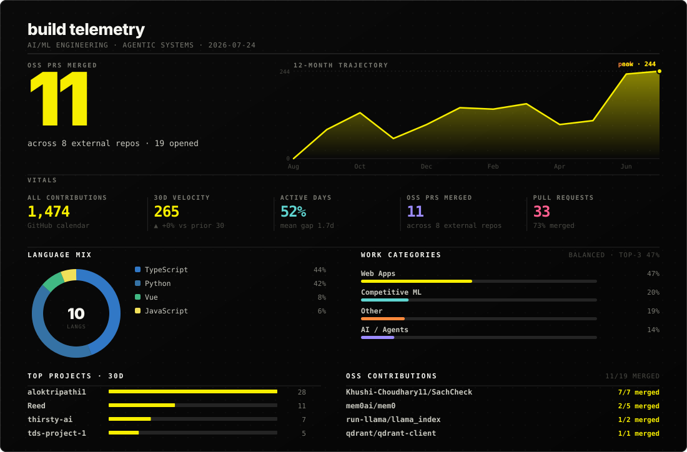
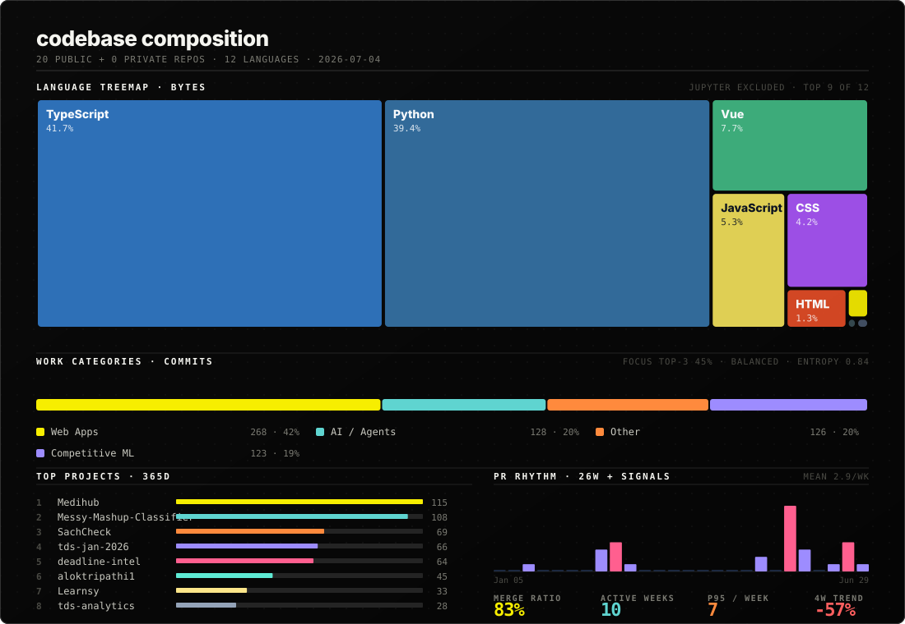

# Alok Tripathi

> crafting intelligence from chaos.

I'm a Data Science student at IIT Madras, building AI/ML systems, agentic pipelines, and applied research projects. My work spans machine learning, RAG pipelines, and full-stack applications, turning ideas into products that solve real problems.

## Projects

- **[SachCheck](https://github.com/aloktripathi1/SachCheck)** - Multi-agent fact-verification system, Claude API, SSE streaming, cost cut from $0.04 to $0.006/check.
- **[Reed](https://github.com/aloktripathi1/Reed)** - Memory-first AI career mentor, Next.js 16, Supabase, Claude API.
- **PRism** - PR review agent.
- **[LumenAI](https://github.com/aloktripathi1/LumenAI)** - RAG over ML papers, Qdrant, sentence-transformers.

### `stack`

| | |
|:---|:---|
| **Languages** |  |
| **ML / Data** |  |
| **Backend & Infra** |  |
| **Frontend** |  |
| **Tools** |  |

 

### `stats`

 
<table>
  <tr>
    <td align="center">
      
    </td>
    <td align="center">
      
    </td>
  </tr>
</table>
  

  

  

 
<code>stay curious · keep shipping</code>
  
<!-- 

 -->
